# Unofficial Symphony Maestro for Apogee Symphony I/O MK I

_Note: I don’t have a tip jar, but if you find this useful and you’re motivated to donate, please feel free to make a donation in my name to the [SF-Marin Food Bank](https://www.sfmfoodbank.org). That would certainly mean a lot to me. They’re a great organization and incredibly efficient with their funds._

Modern Apple Silicon support for the Apogee Symphony I/O MK I on **macOS 26**.

**Download:** <a href="https://github.com/danielraffel/unofficial-symphony-maestro-mk1/releases/latest/download/UnofficialSymphonyMaestro-latest.pkg">
Unofficial Symphony Maestro (latest .pkg)
</a> &nbsp;·&nbsp; <a href="https://github.com/danielraffel/unofficial-symphony-maestro-mk1/releases">all releases</a>

If you test it, please read the [feedback](#feedback) section and consider sharing how it went so this can be updated to show what has been tested.

_**Note:** Due to the limited testing of this software you should closely read the disclaimers in this read me and the license agreement before installing._

## Overview

This project restores support for the **Apogee Symphony I/O MK I** on Apple Silicon Macs running macOS 26.

It was developed with **Apogee's knowledge and blessing**, but it is **not affiliated with, supported by, or endorsed by Apogee** in any way. Apogee does not provide support for this software.

Due to the technical approach used, this software **requires an Apple Silicon Mac running macOS 26**. It will **never support Intel Macs or versions of macOS earlier than macOS 26**.

## What's Included

- Modern **Maestro** desktop application for basic device configuration
- Native **Thunderbolt DriverKit** driver
- Modern **USB** implementation using Apple's USB audio stack
- Hardware volume key support when using USB
- Appearance controls with **Auto**, **Light**, and **Dark** modes
- Optional in-app updates through Sparkle, with scheduled checks enabled by default and a manual check available any time

## Appearance and updates

Maestro follows your Mac by default with **Auto** appearance. You can choose **Light** or **Dark** in **Device Settings › Preferences**; the choice applies only to Maestro and is saved for the next launch.

Maestro includes optional in-app updates powered by Sparkle. Scheduled update checks are enabled by default, but you can turn them off in **Device Settings › Preferences**. Manual **Check for Updates…** remains available whenever you want it. Updates are downloaded from the public [Unofficial Symphony Maestro GitHub repository](https://github.com/danielraffel/unofficial-symphony-maestro-mk1); no telemetry is collected by the updater.

<table>
<tr>
<td width="50%"><a href="docs/screenshots/update-available.png">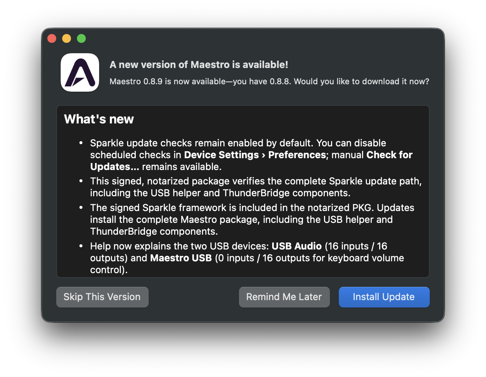</a> Update notifications show the release notes before you install.</td>
<td width="50%"><a href="docs/screenshots/update-current.png">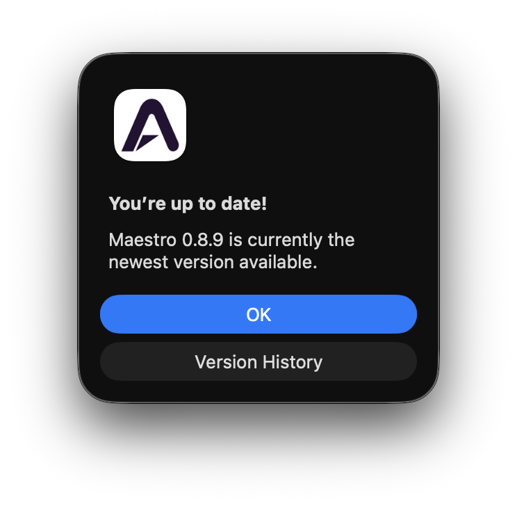</a> Manual checks also report when you are already up to date.</td>
</tr>
</table>

## Screenshots

<table>
<tr>
<td width="50%"><a href="docs/screenshots/input.png">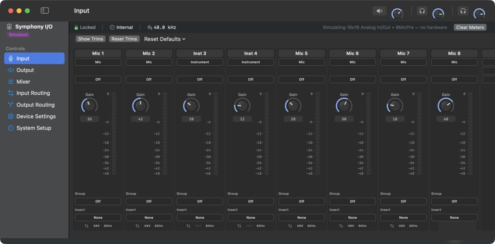</a> <b>Input</b> — a strip per installed converter: analog and digital reference, soft limiter, meters, and trims on demand.</td>
<td width="50%"><a href="docs/screenshots/output.png">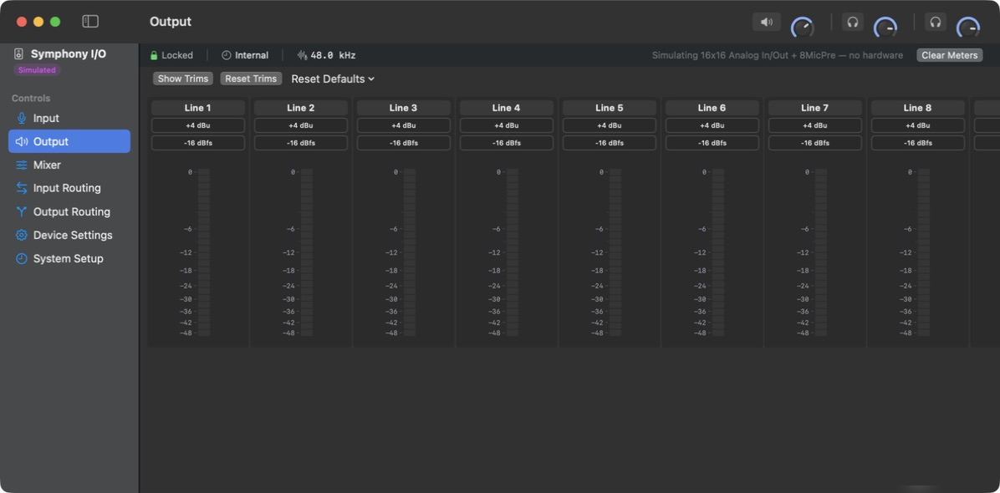</a> <b>Output</b> — the same per channel on the way out, plus the monitor section to the right.</td>
</tr>
<tr>
<td width="50%"><a href="docs/screenshots/headphones-speakers.png">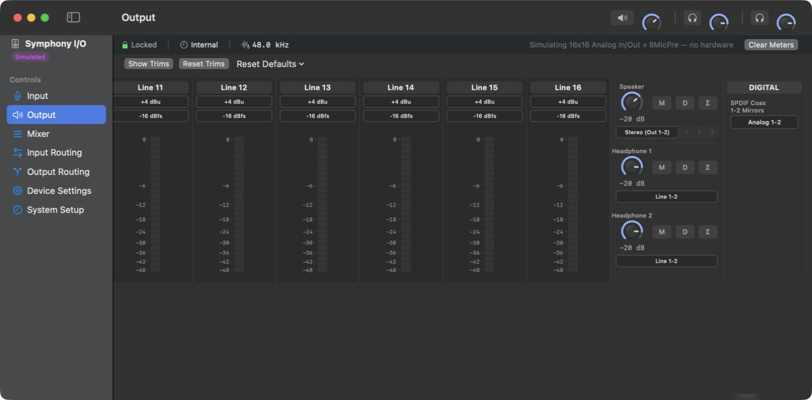</a> <b>Speaker and headphones</b> — the monitor section: level, Mute / Dim / Sum, and what each output listens to.</td>
<td width="50%"><a href="docs/screenshots/mixer.png">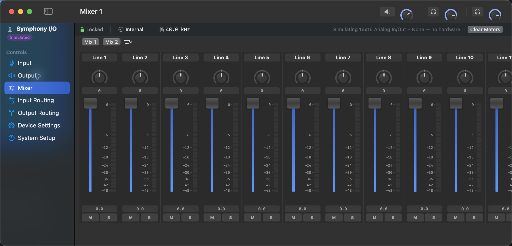</a> <b>Mixer</b> — two low-latency mixes, each with pan, fader, mute and solo.</td>
</tr>
<tr>
<td width="50%"><a href="docs/screenshots/input-routing.png">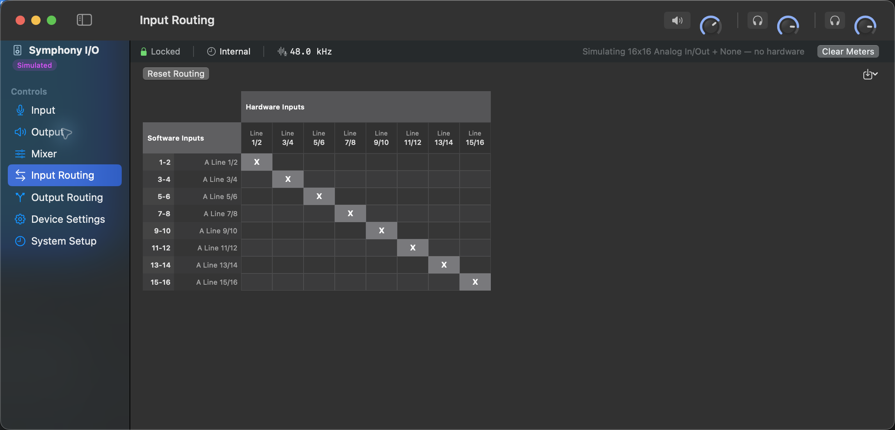</a> <b>Input Routing</b> — which hardware input feeds which software input.</td>
<td width="50%"><a href="docs/screenshots/output-routing.png">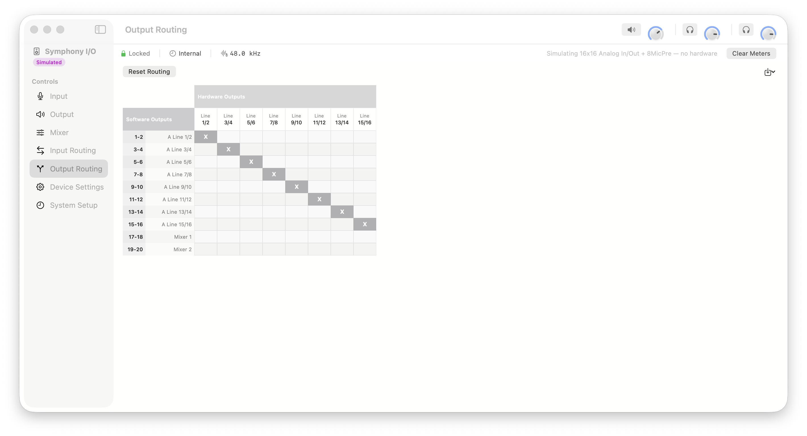</a> <b>Output Routing</b> — which software output or mix feeds which hardware output.</td>
</tr>
<tr>
<td width="50%"><a href="docs/screenshots/device-settings.png">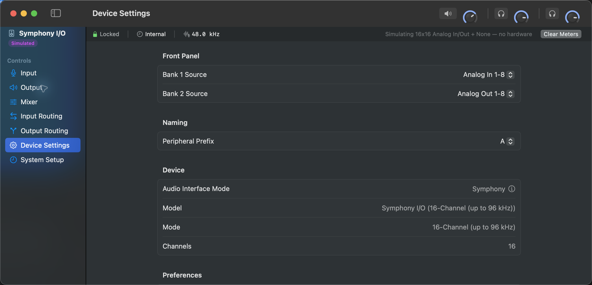</a> <b>Device Settings</b> — front-panel meter banks, peripheral prefix, and editable insert labels.</td>
<td width="50%"><a href="docs/screenshots/system-setup.png">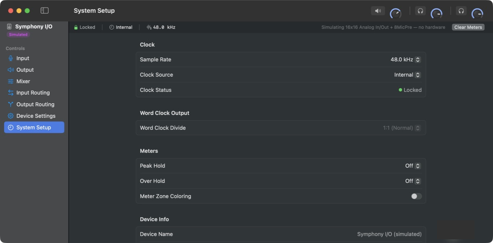</a> <b>System Setup</b> — clock and sample rate, word clock divide, meter hold behaviour, and what is installed.</td>
</tr>
</table>

### Mic Pre

With an 8MicPre installed, channels 1-8 gain a preamp: gain, 48 V phantom, polarity, an 80 Hz high-pass, Group, and the Insert controls. Only the first four channels offer Instrument, because that is how many 1/4" jacks the module has.

<a href="docs/screenshots/input-micpre.png">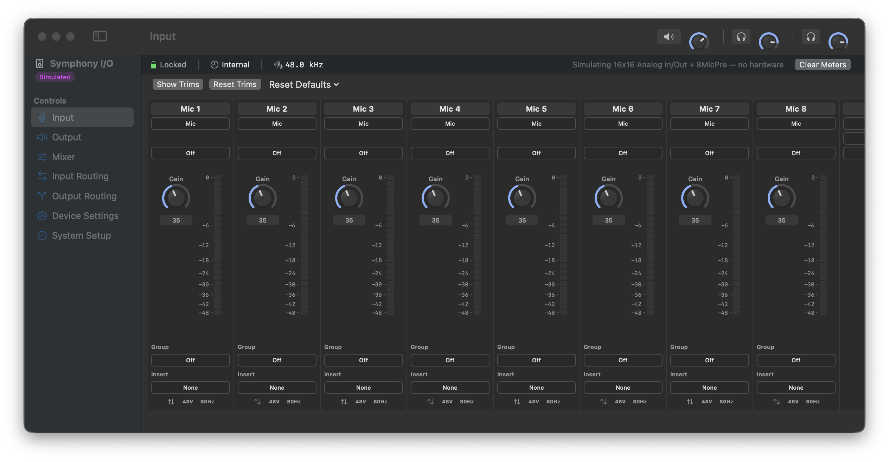</a>

> **The device-control screenshots use Maestro’s built-in card simulator**, with a 16x16 Analog In/Out module and an 8MicPre where shown. The “no hardware” banner identifies simulated views; the Sparkle update dialogs above are from a real update. I don't own an 8MicPre, so the Mic Pre controls above are built from Apogee's own source and verified in simulation, but **they have never run on a real Mic Pre module.** If you have one, I'd like to hear how close this is.

## Requirements

- Apple Silicon Mac (M-series)
- macOS 26
- Apogee Symphony I/O MK I

_Intel Macs and earlier versions of macOS are not supported._

## Beta Status

This is an **early beta release**.

At the time of this release, the software has only been tested on a single system. I'm looking for a small number of technically experienced users who are comfortable testing pre-release software and providing feedback.

If your Mac is mission-critical, I strongly recommend testing on a secondary machine rather than your primary workstation.

## Tested Hardware

This release has only been tested with:

- Apple Silicon Mac running macOS 26
- Apogee Symphony I/O MK I
- 8×8 Analog-Optical I/O module
- 16×16 AD Optical I/O module

If your hardware configuration differs, it may work, but it has not yet been verified.

## Installation

The installer is:

- Apple signed
- Apple notarized

Installation should be straightforward without requiring any special security workarounds.

The installer includes a <a href="https://github.com/danielraffel/unofficial-symphony-maestro-mk1/blob/main/license.md">conservative license agreement</a> stating that the software is provided **as-is**, without warranty. While I do not expect problems, I want to be transparent that this software has undergone very limited real-world testing.

## Feedback

If you have a Symphony I/O MK I and an Apple Silicon Mac running macOS 26, I’d appreciate hearing how it goes.

If you encounter problems, please <a href="https://github.com/danielraffel/unofficial-symphony-maestro-mk1/issues/new">file an issue</a> and include:

* Whether you’re using USB or Thunderbolt
* Installed I/O modules
* Mac model
* Any other relevant hardware details

I’ll follow up with any additional information that would help diagnose the issue.

If everything works, I’d also appreciate a <a href="https://github.com/danielraffel/unofficial-symphony-maestro-mk1/issues/new">short issue</a> saying so. Positive reports are valuable because they help others understand which hardware configurations have been tested successfully and build confidence that the software is working across different systems. I’ll keep this updated with a compatibility matrix showing the hardware configurations that have been tested.

## Support

This is an independent community project.

Apogee does **not** provide support for this software. Please direct all feedback, bug reports, and questions to this project's GitHub Issues page.

Note: Assuming beta testing goes well and this works reliably for others, I’ll explore open sourcing the software. There are a few complexities to work through, so that’s a lower priority for now, and I can’t promise it will happen.

## Acknowledgments

Many thanks to Apogee for their cooperation during development, for trusting me and for making it possible to explore restoring support for this hardware on modern versions of macOS. “Apogee”, “Symphony” and "Maestro" are trademarks of their respective owners, used here only for identification and compatibility. 

During development I sent countless commands that could easily have bricked my device, while I did have to reboot my machine a lot I never encountered a single unrecoverable issue. That’s a real testament to the engineering and care that went into the Apogee firmware. The team clearly designed it to guard against invalid states, preventing me from ever putting the hardware into a bad or unrecoverable condition. Respect.

## Appendix
- <a href="https://knowledge.apogeedigital.com/legacy-symphony-i/o-mk-i-guide-for-intel-and-apple-silicon-macs">About Apogee Symphony I/O MK I</a> 
- <a href="https://www.soundonsound.com/reviews/apogee-symphony-io">Sound on Sound Review of Apogee Symphony I/O MK I</a>
- <a href="https://gearspace.com/threads/apogee-symphony-i-o.516748/page-45">Gearspace Thread Announcing project</a>
